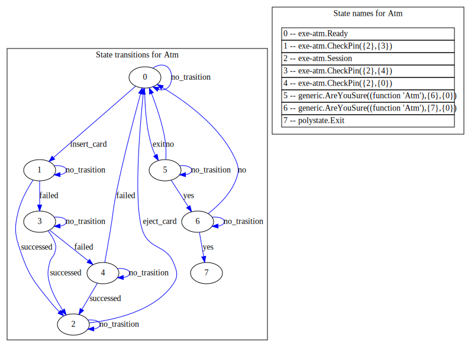
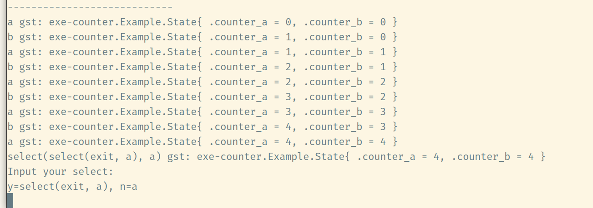

# polystate-examples
Examples for polystate, Requires the [latest zig compiler](https://ziglang.org/download/).

The latest x86 backend of the zig compiler has switched to the zig implementation. Unfortunately, it cannot handle tail recursion. Therefore, the demo code needs to be compiled in Release mode.

# examples

## atm
```shell
zig build -Doptimize=ReleaseFast atm
```



## counter
```shell
zig build -Doptimize=ReleaseFast counter
```



## TodoList
```shell
zig build -Doptimize=ReleaseFast todo
```


## Editor
```shell
zig build -Doptimize=ReleaseFast editor
```


## Cont
```shell
zig build -Doptimize=ReleaseFast cont
```

