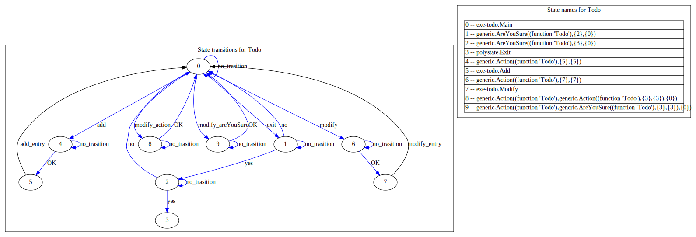

# polystate-examples
Examples for polystate, Requires the zig 0.14.1 ~ latest version.

# examples

## atm
default pin: 1234
```shell
zig build atm
```




## counter
```shell
zig build counter
```


## TodoList
```shell
zig build todo
```



## Cont
```shell
zig build cont
```


